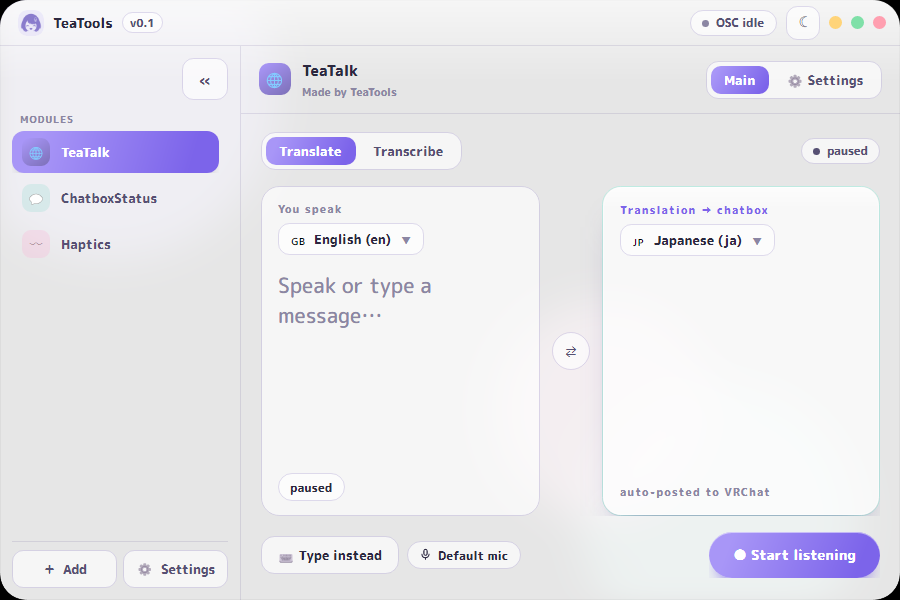

# Getting started with TeaTalk

This gets your spoken words appearing in the VRChat chatbox — translated — in about five minutes, for free. No account, no API key.

## Before you start

You need three things:

1. **Windows.**
2. **VRChat running with OSC enabled.** In VRChat, open the Action Menu → **Options → OSC → Enable**. (You only do this once; VRChat remembers it.) TeaTools talks to VRChat over OSC on the standard port, so this switch has to be on.
3. **A microphone** that Windows can hear.

## 1. Turn TeaTalk on

TeaTalk ships **disabled** — TeaTools starts as a bare hub so nothing runs that you didn't ask for.

1. Open TeaTools.
2. On the **Home** screen, find TeaTalk in the module list and enable it.
3. TeaTalk appears in the left rail. Click it.

## 2. Pick your microphone (once, for the whole app)

The mic and its sensitivity are a **shared hub setting**, not a TeaTalk setting — every module that listens uses the same one.

1. Go to **Home → General → Audio capture**.
2. Choose your capture device.
3. Watch the level meter as you talk. The bar should jump when you speak and sit still when you're quiet. If it's twitchy when you're silent, or flat when you talk, see [voice detection](troubleshooting.md#voice-detection) — but the defaults are fine for most mics.

## 3. Say something

1. Open **TeaTalk** from the rail. You're on the main panel.
2. TeaTalk starts in **Translate** mode. The left picker is your **spoken** language and the right is the **chatbox** language — out of the box that's **Detect language** (it auto-detects what you say) → **Japanese**. Click either picker to change it. Picking a specific spoken language instead of Detect makes local speech-to-text a little faster and lets you use the swap button to flip the pair.
3. Click **Start listening**.
4. Talk. Your words show up in the **transcript** card as they're recognized, and the translated line lands in your VRChat chatbox — you'll see it in the **chatbox output** card too.
5. Click **Stop listening** when you're done.

> **First time only:** the free local speech engine downloads a ~142 MB model before it can recognize anything. It happens automatically on your first listen and is cached forever after. Give it a moment on the very first run.

## 4. Prefer to type?

You don't have to talk. The main panel has a **type-instead** box — type a line, send it, and it goes through the same translate/transcribe path to your chatbox. This works whether or not you're listening.

## That's it

You're running the entire free path: local Whisper for speech-to-text, Microsoft Edge for translation, zero cost, zero keys.

From here:

- Only want your **own** words in the chatbox (no translation)? Switch to **Transcribe** mode — see the [guide](guide.md#modes).
- Want higher-quality AI translation, or cloud speech-to-text? Those are optional and need a key — see [engines](guide.md#engines).
- Non-verbal, or want to stay muted in VRChat while still "talking" via text? See [mute behavior](guide.md#mute-behavior).
